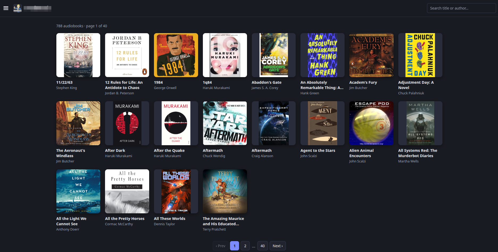

# BookPod — Audiobook RSS Feed Library

A small self-hosted web app that turns an audiobook RSS feed into a browsable,
searchable library of covers. Built with **FastAPI + Jinja2 + HTMX** — no Node,
no frontend build tools.

- Paste any audiobook RSS URL (or point it at a local feed) and get a paged grid
  of covers with title + author.
- Search by **title or author** (partial, case-insensitive); author names are
  clickable to filter by that author.
- Click a book to open a detail drawer with metadata and an embedded `<audio>`
  player. The player keeps playing across pagination and when the drawer is
  closed.
- Feeds and cover images are **cached on disk**, so repeat loads are fast and
  offline-friendly. Covers are fetched lazily — only for the page you view.

## Screenshot



## Project layout

```
main.py                 FastAPI application (routes, search, per-feed library)
feed.py                 RSS parsing + SHA-1 disk caching
enrich.py               OpenLibrary enrichment lookups (genres + synopsis)
config.py               Loads config.toml (defaults + TOML merging)
config.toml             Private configuration (git-ignored)
config.toml.example     Committed template for config.toml
templates/              Jinja2 templates (base, grid, detail, empty, enrich)
requirements.txt        Python dependencies
bookpod.service.example Example systemd unit
startup.sh              Convenience: runs uvicorn locally
```

## Requirements

- Python 3.11+ (3.14 used in dev; 3.11+ is needed for the stdlib `tomllib`
  used to read config.toml). On Debian/Ubuntu, install the venv module if
  missing: `sudo apt install python3.14-venv` (adjust the version).
- Packages in `requirements.txt` (FastAPI, Uvicorn, Jinja2, python-multipart,
  requests).
- Internet access on first load (to fetch the feed and cover images) and for
  OpenLibrary enrichment, unless you point everything at local files and a warm
  cache.

## Quick start (local dev)

```bash
cd <project-dir>

# One-time setup
python3 -m venv .venv
.venv/bin/pip install -r requirements.txt

# Configure the app (optional; see "Configuration")
cp config.toml.example config.toml   # then edit config.toml with your settings

# Run
./startup.sh                           # or: .venv/bin/uvicorn main:app --host 127.0.0.1 --port 8000
```

Open http://127.0.0.1:8000. With no `?rss_url=` in the URL you'll see the "get
started" state; use the ☰ menu to enter a feed URL, or load one directly:

```
http://127.0.0.1:8000/?rss_url=https://example.com/feed.rss
```

## Configuration

Configuration lives in **`config.toml`** (git-ignored, so it can hold private
settings such as a personal feed URL). Copy `config.toml.example` to
`config.toml` and edit it:

```toml
[feed]
# Default RSS feed shown when the app opens. "" (blank) = require the user to
# enter a URL in the menu.
url = ""

[enrichment]
# Look up genres + synopsis from OpenLibrary when a book is opened.
enabled = true

[app]
# Books per page.
page_size = 20
# Custom cache directory. "" = default (~/.cache/audiobook_feed_library).
cache_dir = ""
# Force re-fetch of feeds and covers on startup.
refresh_on_start = false
```

The default feed resolution is: `FEED_SOURCE` env var, then `[feed] url` from
`config.toml` (which may be blank). Environment variables override the TOML
values:

| Variable | Overrides | Notes |
|----------|-----------|-------|
| `FEED_SOURCE` | `[feed] url` | Default feed source |
| `CACHE_DIR` | `[app] cache_dir` | Where feeds + covers are cached |
| `PAGE_SIZE` | `[app] page_size` | Books per page |
| `REFRESH` | `[app] refresh_on_start` | `1`/`true` forces re-fetch on startup |
| `BOOKPOD_CONFIG` | — | Path to a different config file |

Covers are written to `covers/<sha1(feed)>/NNNN.jpg` (one subdirectory per feed)
and served at `/covers/...`.

## OpenLibrary enrichment

When a book is opened, BookPod can pull extra metadata from the
[Open Library](https://openlibrary.org/) API and show it in the detail drawer:
corrected title/author, genre tags, and a synopsis.

The lookup in `enrich.py` is a two-step call:

1. `https://openlibrary.org/search.json?title=…&author=…` — finds candidate
   Works and scores them by **title first, then primary author**.
2. `https://openlibrary.org{work_key}.json` — the synopsis (`description`) and
   genres (`subjects`).

Audiobook feed titles are noisy, so the lookup defends against common misses:

- **Looser title variants**: if the full title (e.g. *Foo: A Novel*) returns no
  search results, it retries with the part before the colon, then with trailing
  series markers (*Book 2*, *Volume 1*) stripped.
- **Synopsis-first selection**: instead of blindly trusting the top-scored
  match (which is often a boxed set or audiobook record with no description),
  it walks the scored candidates and returns the first Work that actually has a
  synopsis, falling back to the best match otherwise.
- **Punctuation normalization**: curly apostrophes/dashes are folded before
  comparing titles and authors.

Details:

- Requests use a descriptive `User-Agent` out of courtesy (helps avoid
  rate-limiting) and a short timeout; candidate Works are probed concurrently
  (up to 4) only when the top match lacks a synopsis.
- Results are cached in memory (keyed by title+author), so reopening a book
  doesn't re-query the API.
- The feature is best-effort: if OpenLibrary has no good match (e.g. the feed
  title differs from the canonical one, like *1984* vs *Nineteen Eighty-Four*),
  the drawer just shows the feed's own data and a "no additional info" note —
  the app keeps working regardless.
- If OpenLibrary itself is unreachable (down or blocked), the drawer shows a
  distinct "can't reach the enrichment service" warning instead, and BookPod
  remembers that briefly (default 5 minutes) before retrying, so it recovers
  automatically once the service is back.
- Toggle it off globally in `config.toml`:

  ```toml
  [enrichment]
  enabled = false
  ```

## Deploying as a systemd service

An example unit is provided in `bookpod.service.example`. Copy it to
`/etc/systemd/system/bookpod.service`, then adjust it to **your** install:

```ini
User=<your-user>                     # the user that owns the app
Group=<your-user>

WorkingDirectory=/path/to/BookPod    # where main.py lives
ExecStart=/path/to/BookPod/.venv/bin/uvicorn main:app --host 127.0.0.1 --port 8000

# If the app lives under /home/<user>/..., hardening MUST allow access:
ProtectHome=false
ReadWritePaths=/path/to/BookPod
```

> **Important (the 203/EXEC gotcha):** with `ProtectHome=true`, systemd makes
> `/home` unreadable to the service — so if your install is under `/home`, set
> `ProtectHome=false`, or the process fails with `status=203/EXEC`.
> Also, the venv must be created **on the server** (never copied from another
> machine), otherwise the `bin/uvicorn` shebang points at a Python that doesn't
> exist there.

Then:

```bash
sudo cp bookpod.service.example /etc/systemd/system/bookpod.service
sudo systemctl daemon-reload
sudo systemctl enable --now bookpod
journalctl -u bookpod -f     # follow the logs
```

The service binds to `127.0.0.1:8000`; put a reverse proxy (nginx/Caddy) in
front if you want to expose it. If you set `CACHE_DIR` to a custom path, add it
to `ReadWritePaths`.

## Caching

- **Feeds**: a URL-sourced feed is cached under `<CACHE_DIR>/feeds/` and reused
  on later runs. The browser "Refresh feed" button (in the ☰ menu) re-fetches.
- **Covers**: cached under `<CACHE_DIR>/images/`, keyed by `SHA-1(feed + image
  URL)` with a JSON sidecar so each entry is validated against both the feed and
  the image URL. Serving comes from the disk cache when available, so repeat
  loads don't hit the network.

## Troubleshooting

| Symptom | Cause / fix |
|---------|-------------|
| `status=203/EXEC` | systemd couldn't run `ExecStart`. Check the venv path exists on the server, the `User` can read/execute it, and `ProtectHome=false` if the app is under `/home`. |
| `Could not import module "main"` | Wrong working directory. Run uvicorn from the app dir (or set `WorkingDirectory=`), or use `--app-dir`. |
| Blank page / throbber never resolves | Feed unreachable or covers failing — check `journalctl -u bookpod -f` for the error, and that the feed URL in `config.toml`/`?rss_url=` is reachable. |
